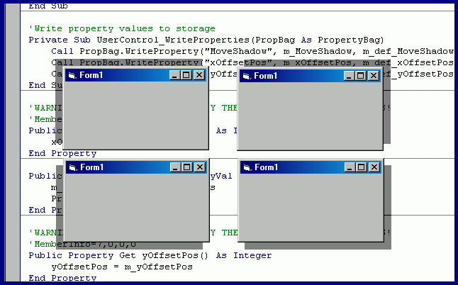



## Shadow OCX

### Description

Create DOS like Shadows to your form with just one line code
 
### More Info
 

             |
---                |---
**Submitted On**   |2002-04-13 09:26:28
**By**             |[PraveenMenon](https://github.com/Planet-Source-Code/PSCIndex/blob/master/ByAuthor/praveenmenon.md)
**Level**          |Beginner
**User Rating**    |4.8 (72 globes from 15 users)
**Compatibility**  |VB 6\.0
**Category**       |[Custom Controls/ Forms/  Menus](https://github.com/Planet-Source-Code/PSCIndex/blob/master/ByCategory/custom-controls-forms-menus__1-4.md)
**World**          |[Visual Basic](https://github.com/Planet-Source-Code/PSCIndex/blob/master/ByWorld/visual-basic.md)
**Archive File**   |[Shadow\_OCX715644132002\.zip](https://github.com/Planet-Source-Code/praveenmenon-shadow-ocx__1-33754/archive/master.zip)

